<p align="center">
  
</p>


<p align="center">
  
  
  
</p>


## Motivación

Este proyecto se basó en el repositorio de [medtorch](https://github.com/medtorch) (ganador de la hackaton Pytorch 2020). Tanto la aplicación como el despliegue fueron procesos muy interesantes, mostrándonos de una forma desafiante como podríamos abordar problemas del mundo real con ayuda de diversas herramientas de Deep Learning.

## Features

- ⚛️ Interfaz creada con [React-Native](https://reactnative.dev/).
- 🍃 Autenticación usando [Mongo DB](https://www.mongodb.com/es).
- 🌀 Chatbot potenciado con [GiftedChat](https://github.com/FaridSafi/react-native-gifted-chat).
- 🔥 Backend potenciado con modelos construidos con [PyTorch](https://github.com/uniMedic/uniMedic-Models).

## Pantallas

#### Login

<p align="center">
  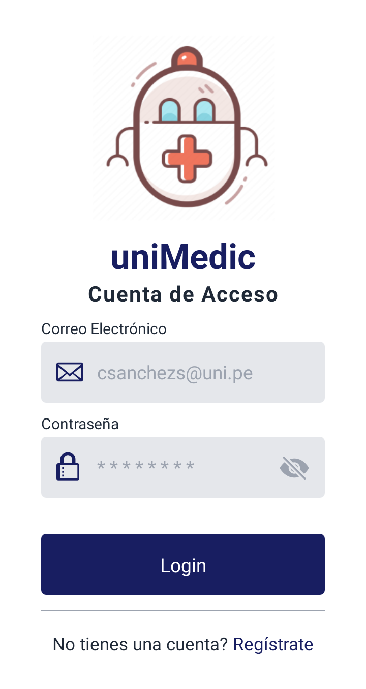
  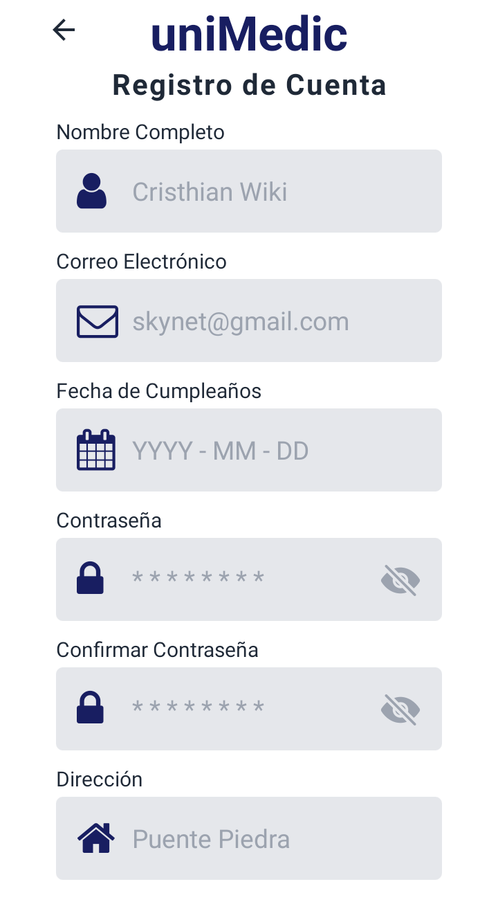
</p>


#### Intro

<p align="center">
  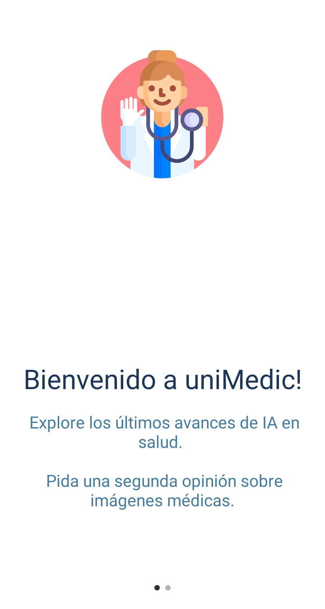
  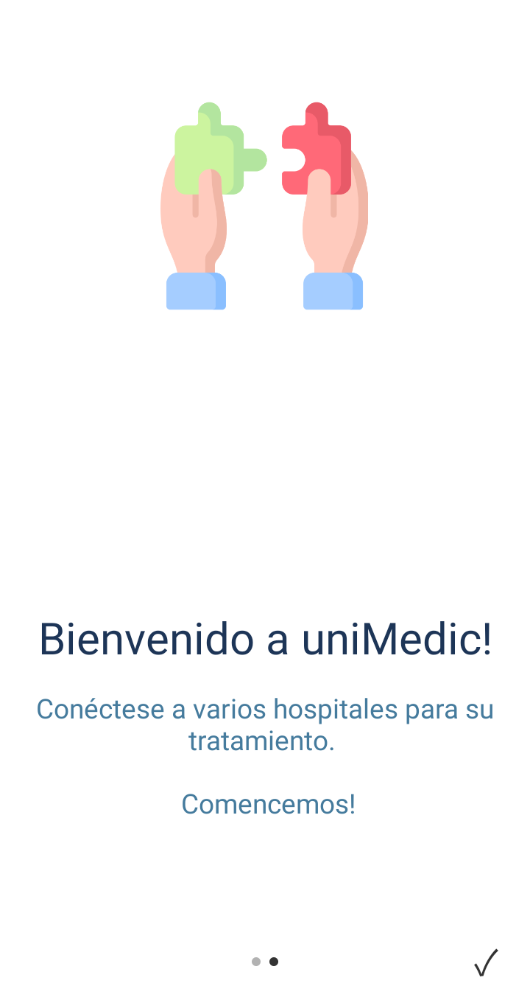
</p>

#### Interfaz paciente (chat)


<p align="center">
  
  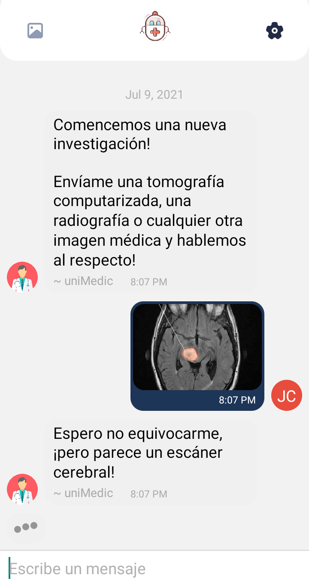
  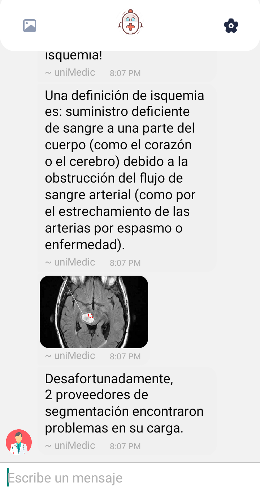
</p>

#### Interfaz médico
<p align="center">
  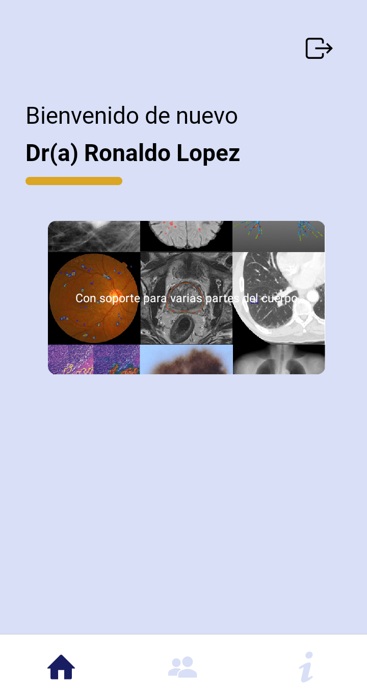
  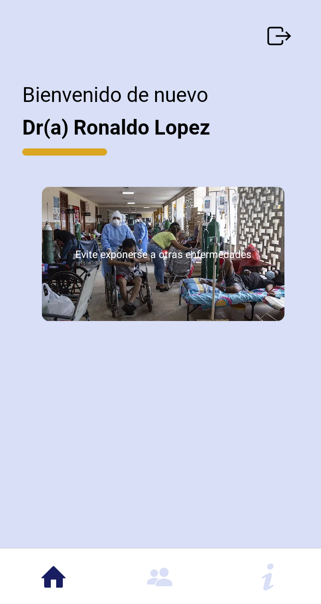
  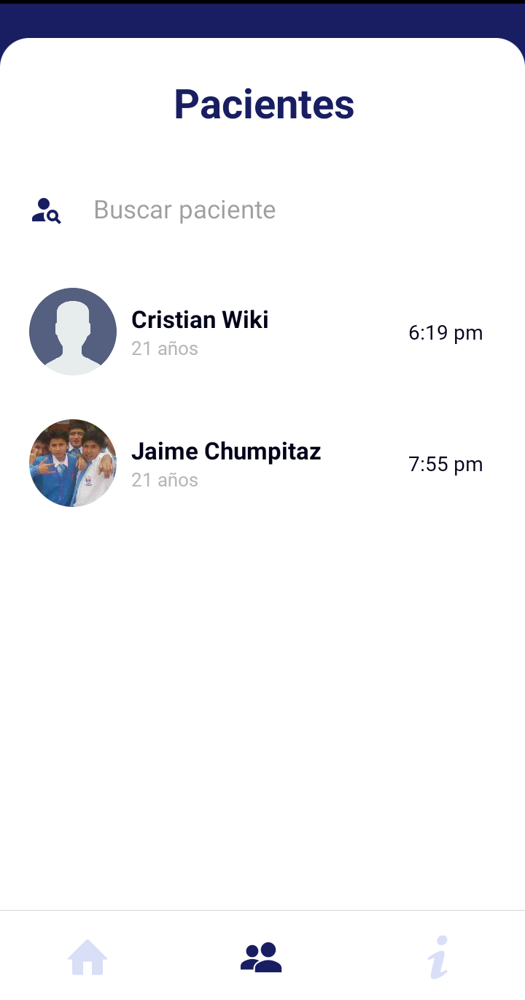
</p>
<p align="center">
  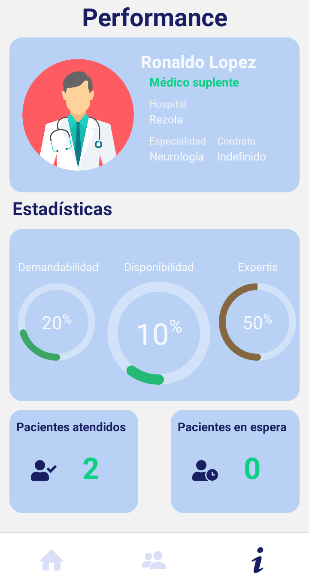
  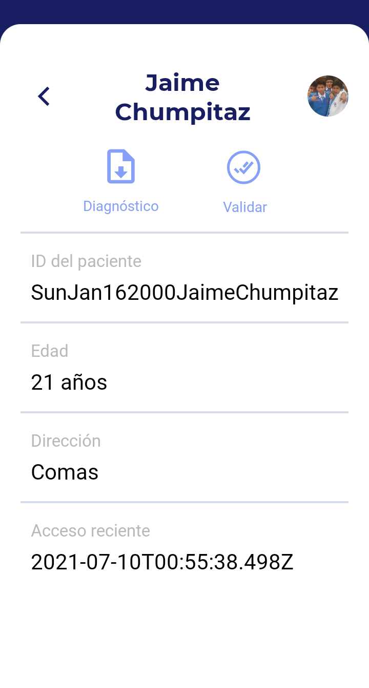
  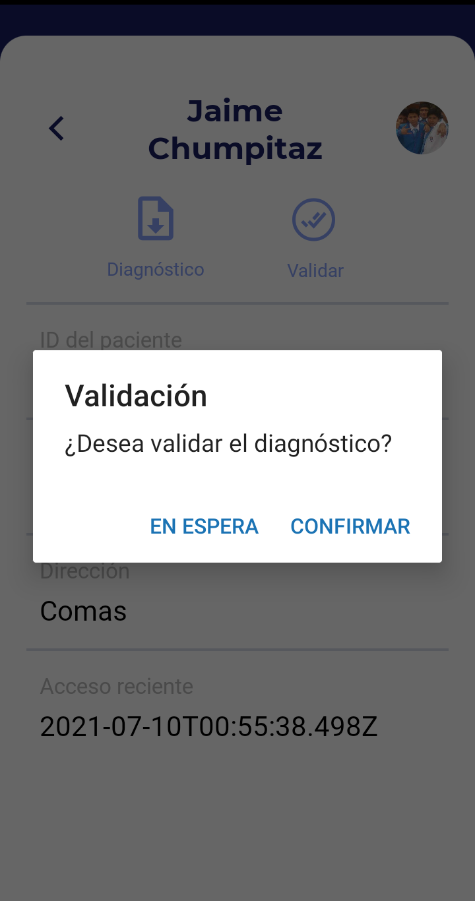
</p>

#### Diagnóstico PDF
<p align="center">
  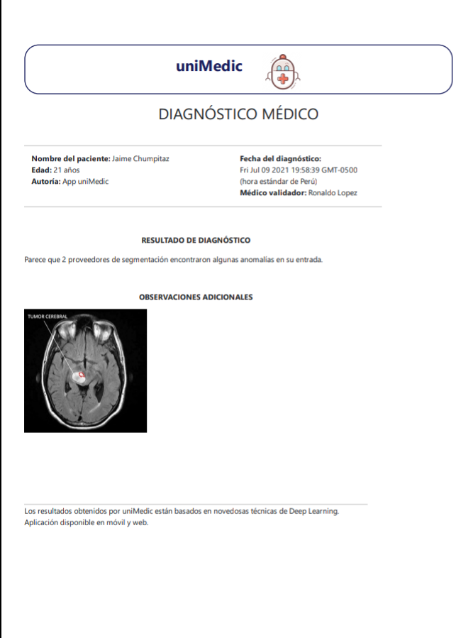
</p>

## Instalación

Seguir [estos pasos](https://reactnative.dev/docs/environment-setup) para configurar tu entorno React Native. 
También le recomiendo siga [este tutorial](https://youtu.be/lGxnOu-K4hU) para poder configurar adecuadamente Android Studio. Para conectar satisfactoriamente su teléfono móvil y/o emulador, necesita [instalar el ADB](https://www.xda-developers.com/install-adb-windows-macos-linux/) y configurar sus variables de entorno. 

Una vez que ha instalado los paquetes con `npm i`, puede ejecutar el siguiente comando:

```bash
npm start
```
Esto automáticamente abrirá [Expo](https://expo.io/) en su navegador. Le recomiendo use [Expo Go](https://expo.io/) para ejecutar la aplicación directamente en su celular sin uso del cable USB.


## Siguientes pasos
 - 🐼 Más modelos PyTorch para tareas de visión.

## Contribuidores

Vea [CONTRIBUTORS.md](CONTRIBUTORS.md) para conocer a los colaboradores de este proyecto.

## Licencia
[MIT License](https://choosealicense.com/licenses/mit/)


